Generate a wide horizontal (16:9 aspect ratio), clean 2D vector technical diagram image that visualises the components and data flows defined in the Mermaid code below.

---
### 1. LAYOUT & FRAMING (MINIMALIST HORIZONTAL)
- Orientation: Single horizontal line from Left to Right, spanning the full width with clean, balanced spacing.
- Domain Titles: Render domain/subgraph names as standalone bold text floating cleanly ABOVE their respective component boxes (do NOT use heavy outer container boxes or shaded backgrounds).
- Background: Pure solid white (#FFFFFF), completely flat vector design (no 3D, no gradients, no shadows).

---
### 2. COMPONENT BOX SPECIFICATIONS
- Standard Nodes:
  * White rounded rectangle cards (#FFFFFF) with a thin, crisp dark border (#1E293B).
  * Inside each box: Place a large, crisp monochrome outline icon centered directly ABOVE the component name.
  * Typography: Clean, centered sans-serif text.
- Highlighted / Adversary Nodes (Threats, Proxies, Anomaly Engines):
  * Fill: Soft pastel rose/pink fill (#FCA5A5 or #FECACA).
  * Border: Dark red dashed border (#DC2626, stroke-dasharray).
  * Icon & Text: Crisp dark icon and bold centered label.

---
### 3. CONNECTOR ARROWS & LABELS
- Standard Flow: Crisp solid black directional arrows with bold step numbering and interface details beside the arrow (e.g., "1. Label (Interface)").
- Intercepted / Internal Flow: Crisp dashed black directional arrows for sequential steps (e.g., "2a. ...", "2b. ...").
- Bypass / Suppressed Path: A faint grey dashed line routed overhead above the components with muted text (e.g., "Baseline Path (Suppressed)").
- Arrow Labels: Clean, horizontal text placed directly adjacent to the corresponding arrow.

---
### 4. OUTPUT REQUIREMENTS
- Output ONLY the finished high-resolution diagram image.
- Ensure all text labels, step numbers, and technical terms from the Mermaid code are rendered accurately and legibly.

---
### MERMAID SOURCE CODE:

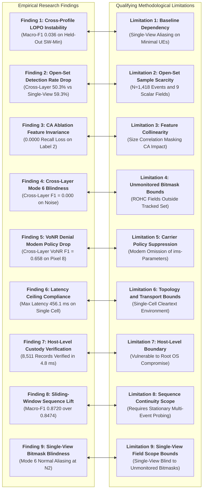

---

**Figure 1**  
*Threat Model of N2 Control-Plane Signalling and On-Path Capability Modification*

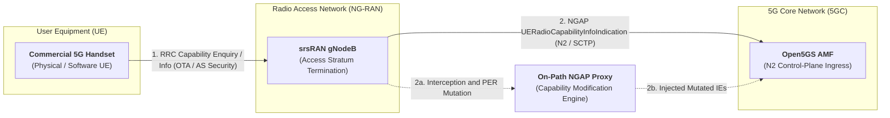

---
**Figure 2**  
*Literature Synthesis and Gap Consolidation Framework Mapping Gaps 1–3 to Research Questions Q1 and Q2*

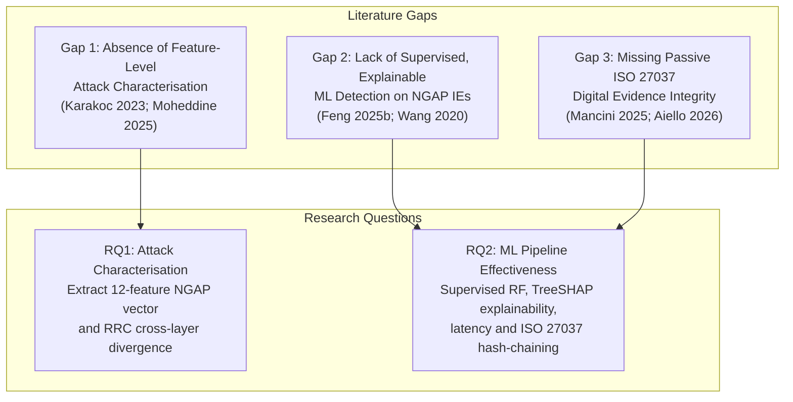

---

**Figure 3**  
*Formal Threat Model: On-Path Active MitM Adversary on the N2 Interface*

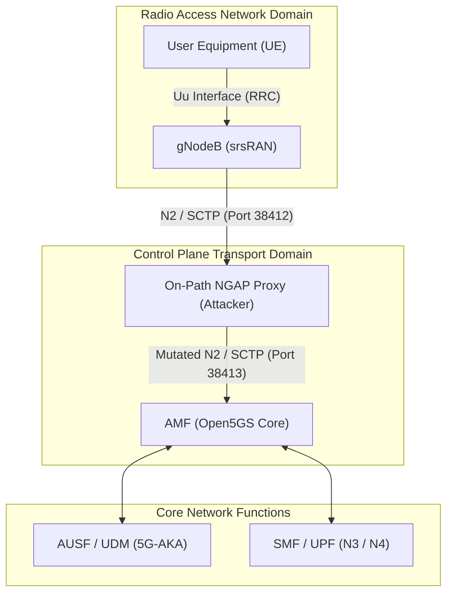

---

**Figure 4**  
*Private 5G Standalone Testbed Architecture and Dual-Point Observation Framework*

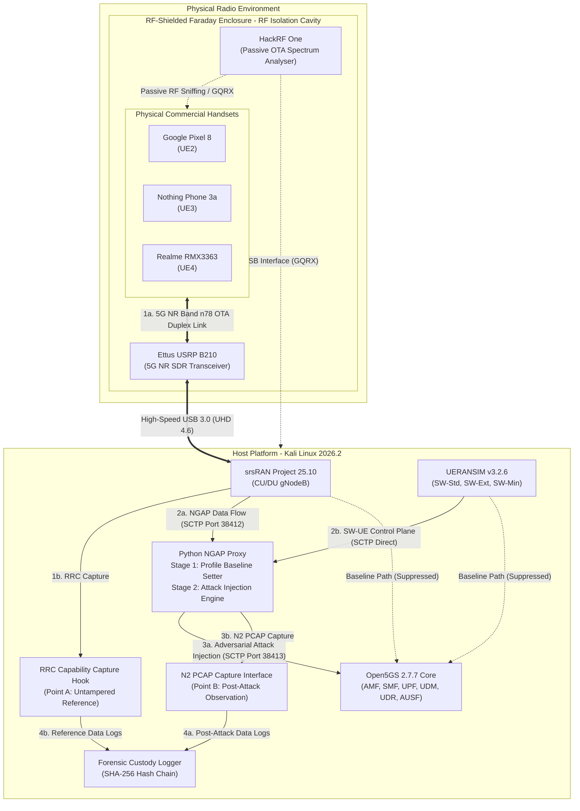

---
**Figure 6**  
*Machine Learning Classification and Game-Theoretic Attribution Workflow*

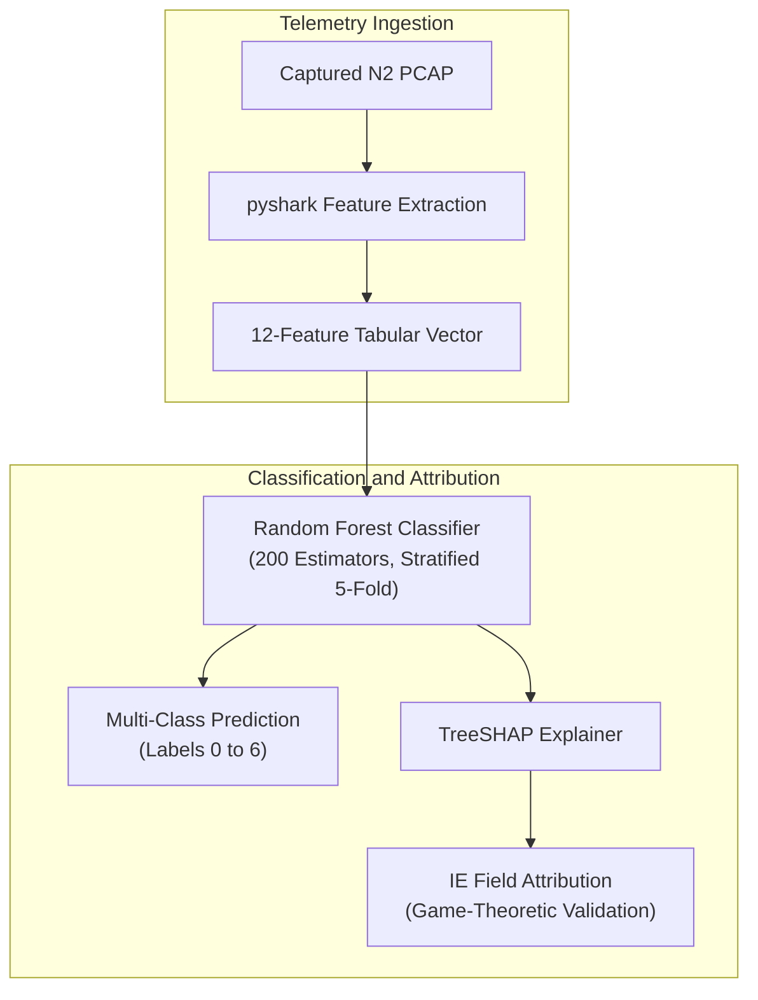

---

**Figure 7**  
*Cryptographic Hash-Chain Custody Record Architecture*

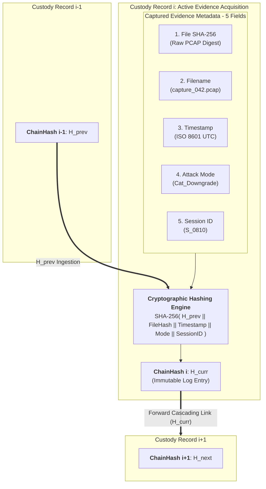

---

**Figure 8**  
*Two-Stage On-Path NGAP Mediation and Attack Injection Architecture*

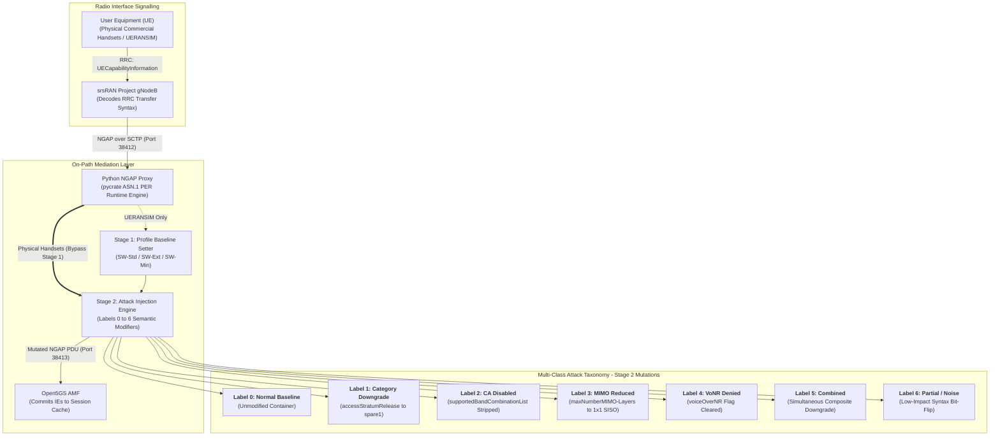

---

**Figure 10**  
*Taxonomy of Feature Discriminative Power Across Protocol Dimensions*

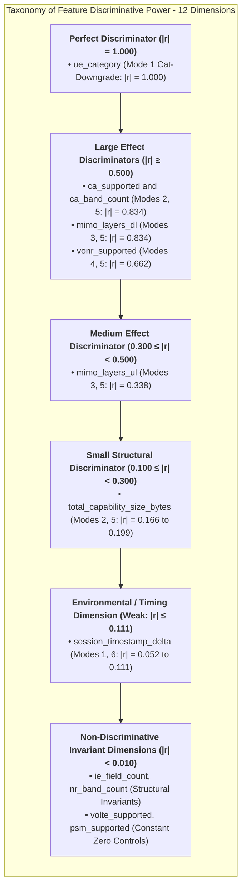

---

**Figure 12**  
*Intra-Class Stability Distribution Across Protocol and Environmental Features*

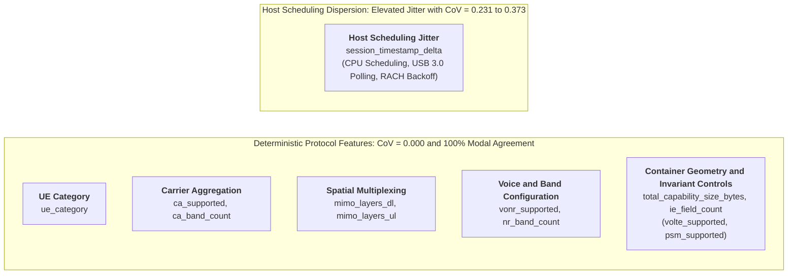

---

**Figure 13**  
*Dual-Point Cross-Layer Observation and Semantic Difference Architecture*

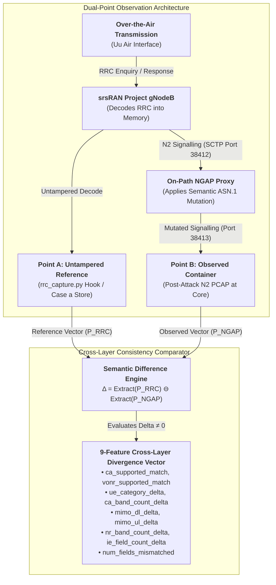

---

**Figure 14**  
*Taxonomy of Supervised Detection Pipelines and Multi-Class Performance*

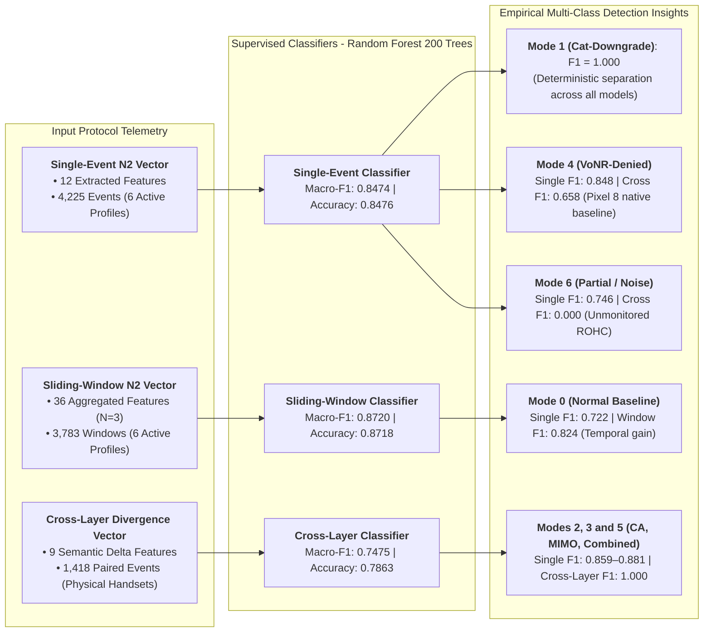

---

**Figure 25**  
*ISO/IEC 27037:2012 Digital Forensic Acquisition and SHA-256 Hash-Chaining Pipeline*

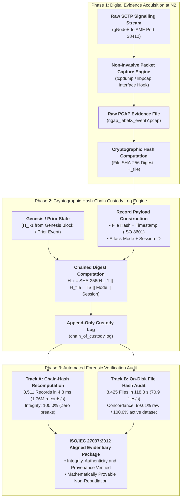

---

**Figure 27**  
*Production 5G Core Deployment Architecture with Passive Optical N2 TAP, ML Inference and SOC/SIEM Integration*

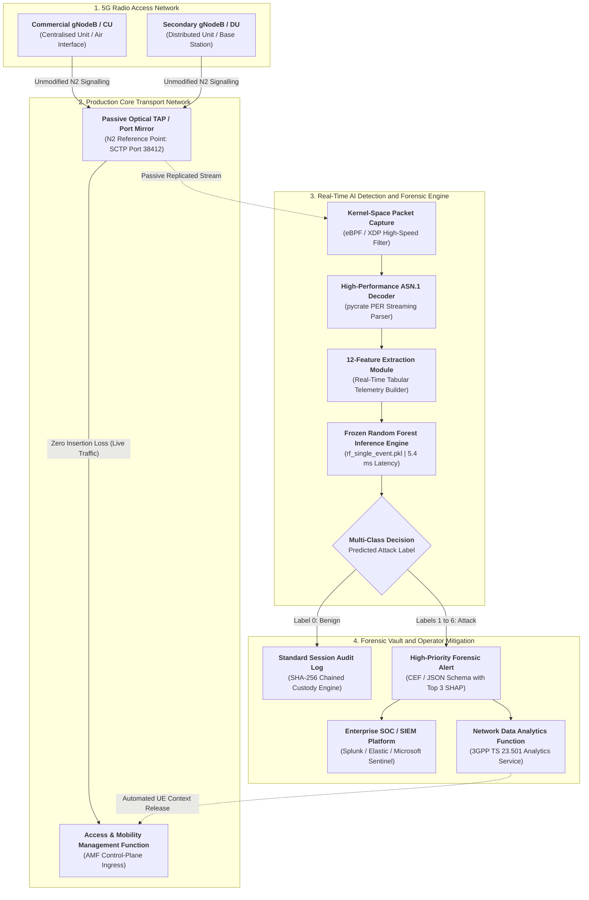

---

**Figure 28**  
*Strict Pairing Between Empirical Research Findings and Methodological Limitations*

---

---

---

